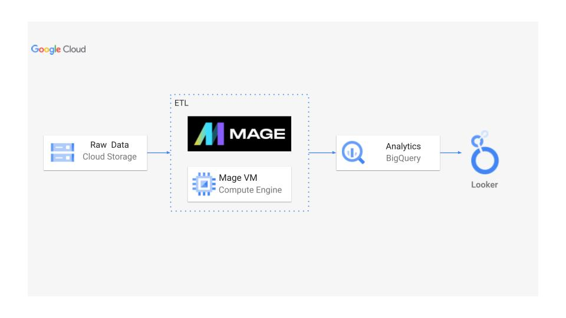

# 🚖 Uber Data Analytics | Modern Data Engineering GCP Project

## 📌 Introduction

This project focuses on performing **data analytics on Uber trip data** using **modern data engineering tools and cloud technologies**. The goal is to build a **scalable ETL pipeline** that integrates **Google Cloud Storage, BigQuery, Mage.ai, and Looker Studio** for data analysis and visualization.

---

## 🏗️ Architecture  


---

## 🛠️ Technology Stack

### 📌 **Programming Language**  
- Python (for data transformation & ETL)

### ☁️ **Google Cloud Platform (GCP) Services**
1. **Google Cloud Storage** - Stores raw Uber trip data  
2. **Compute Instance** - Executes ETL pipelines & transformations  
3. **BigQuery** - Stores processed data for querying & analysis  
4. **Looker Studio** - Data visualization & dashboarding  

### 🔄 **Modern Data Pipeline Tool**  
- [Mage.ai](https://www.mage.ai/) - Used for **building and orchestrating ETL pipelines**  

> 💡 **Contribute to the Mage.ai open-source project**: [GitHub Repository](https://github.com/mage-ai/mage-ai)

---

## 📊 Dataset Used  

The dataset consists of **TLC Trip Record Data**, which includes details of **Yellow & Green taxi trips** such as:  
✔️ Pickup & Drop-off timestamps  
✔️ Pickup & Drop-off locations  
✔️ Trip distances  
✔️ Fare breakdown (rate types, payment types, tolls, etc.)  
✔️ Passenger counts (driver-reported)  

📌 **Dataset Source**: [Uber ETL Data](https://github.com/darshilparmar/uber-etl-pipeline-data-engineering-project/blob/main/data/uber_data.csv)  

📖 **More Information on Dataset**:  
1. Official TLC Website: [TLC Trip Record Data](https://www.nyc.gov/site/tlc/about/tlc-trip-record-data.page)  
2. Data Dictionary: [Yellow Taxi Data Dictionary](https://www.nyc.gov/assets/tlc/downloads/pdf/data_dictionary_trip_records_yellow.pdf)  

---

## 🗃️ Data Model  

  

This **star-schema data model** consists of:  
- **Fact Table**: Contains **ride information** (trip ID, fare amount, distance, duration)  
- **Dimension Tables**: Store details related to **time, location, and passengers**  

---

## 🔄 ETL Pipeline & Data Transformation

1. **Writing Data Transformation Code** 📝 
   - Developed **ETL scripts** in **Jupyter Notebook**  
   - Process includes **data cleaning, feature engineering, and transformations**  
   - File Reference: *Uber Data Pipeline (Fixed Version).ipynb*  

2. **Google Cloud Storage & Mage Installation** ☁️  
   - Store **raw Uber data** in **Google Cloud Storage (GCS)**  
   - Use **Mage.ai** for **ETL orchestration**  

> 🎥 **Video Tutorial**: Check out the complete implementation in this [YouTube Video](https://youtu.be/WpQECq5Hx9g)  

---

## 🔍 BigQuery Data Analysis

✔️ **Perform SQL queries in BigQuery** to extract valuable insights  
✔️ **Analyze trip patterns, fare trends, and peak demand times**  

---

## 📊 Building Dashboards  

**Visualize Uber trip insights using Google Looker Studio (or other BI tools like Power BI/Tableau).**  
Dashboards include:  
✔️ **Trip Heatmaps** - Identify high-demand locations  
✔️ **Revenue Trends** - Monitor Uber's earnings over time  
✔️ **Peak Hour Analysis** - Determine rush-hour periods  
✔️ **Popular Routes** - Show frequently traveled paths  

---

## 🚀 Getting Started  

### 1️⃣ **Clone the Repository**
```bash
git clone https://github.com/tejaskolpek/Uber-Data-Analytics.git
cd Uber-Data-Analytics
